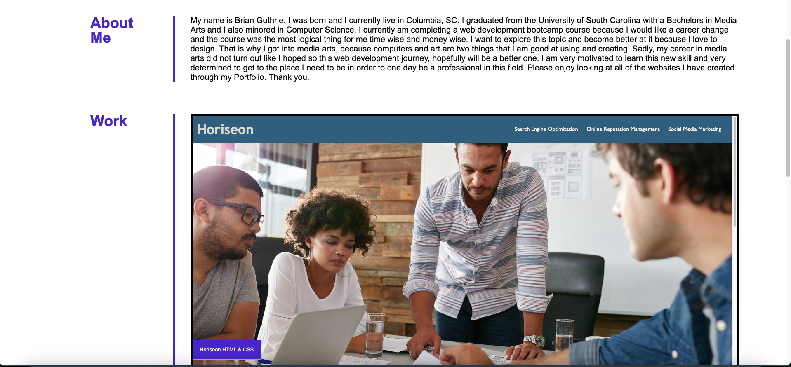
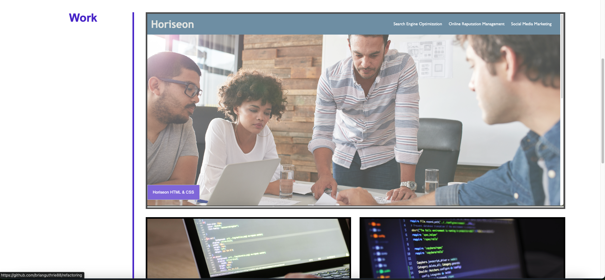
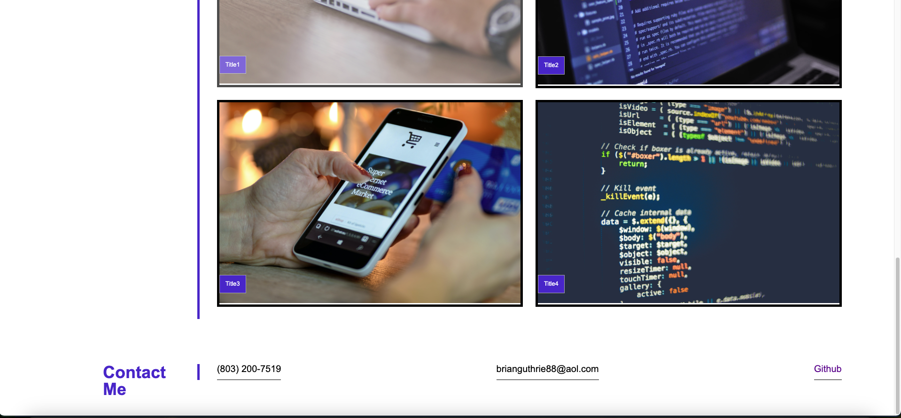
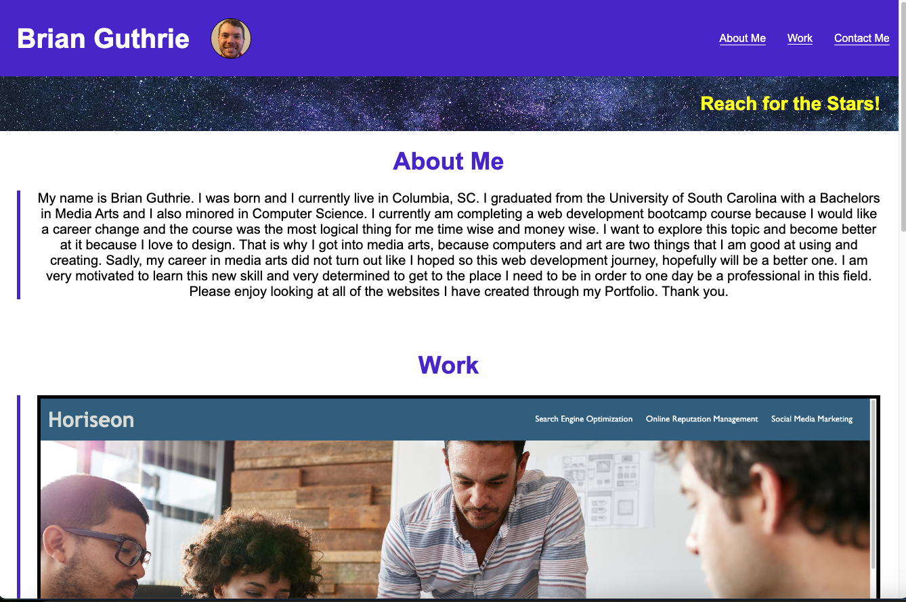
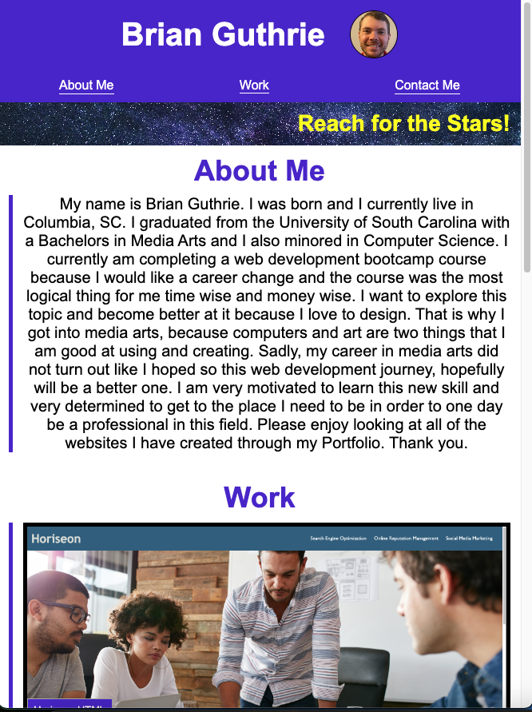
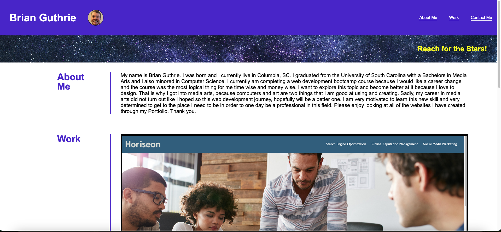

# portfolio

## Description
For this project, we as web developing, boot camp students, wanted to create a website using HTML and CSS that showcased our work as a portfolio for potential employers and peers. The goal of this website was not only to showcase our projects, but to gain experience creating a website with no code and using what knowledge we have learned in html and css to create a running site with responsive design to be used on any size screen. I learned a tremendous amount about how to create my own code and structure both the html and css of my website. Also, how the responsive design works, and how I can manipulate a browser with a reset.css file that resets certain elements of the browser a website is opened in. Overall, this assignement was challenging, but with all of the bugs and research I did to correct those bugs, I feel like a stronger coder.

## Usage
You can use my website to navigate to each section of the page. Also, the repsonsive design, means that when the screen gets smaller, the elements will reorganize to show a better presentation of the content at that size.

Navigation to about me section

Navigation to work section

Navigation to contact me section

reponsive design 1

responsive design 2

## Credits
A tutor helped me, Armando Osorio, who looked over my code and helped me with some areas that my code was lacking in. For example, my media query sections, I wasn't sure what would be best to do, so he helped me to get started and best practices. He also looked over my code to make sure I was on the right track.
I also used https://www.pexels.com/ for some of my images.

## Technologies
Html, CSS

## Questions
For any questions, please reach out by creating an issue.

## Deployment Section

My Webpage
